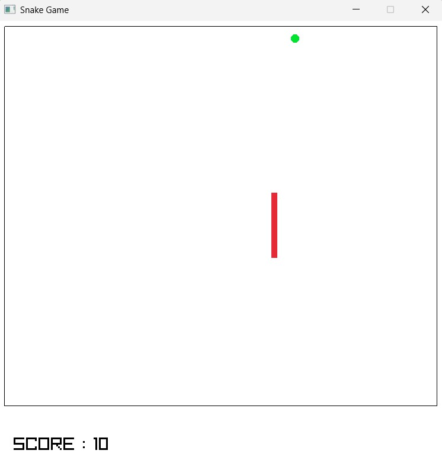
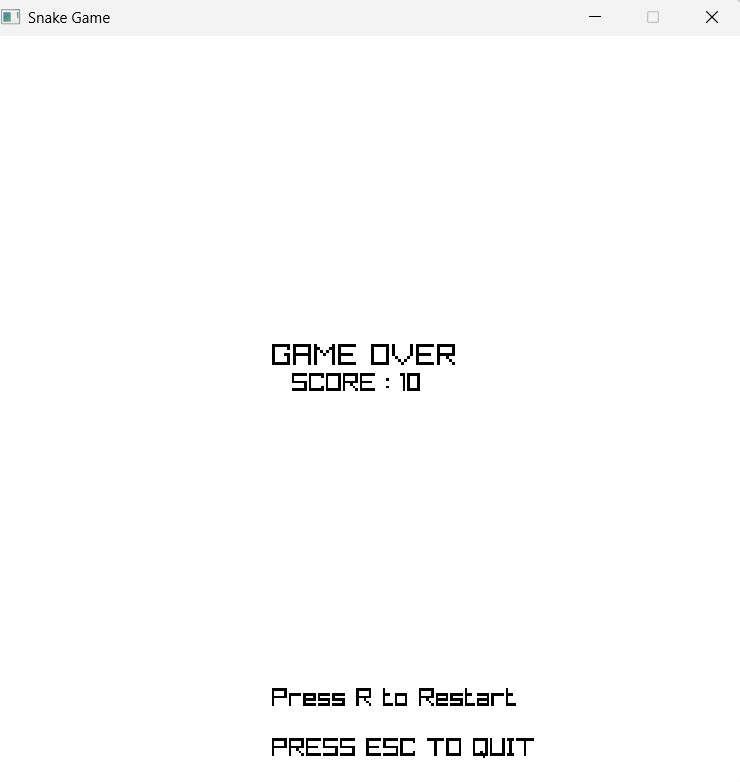

# 🐍 Snake Game using Python and Pyray

A classic Snake Game built using **Python** and the **Pyray** graphics library. This project demonstrates fundamental game development concepts such as game loops, keyboard input handling, collision detection, object movement, score tracking, and state management.

---

# 📸 Preview




---

# ✨ Features

- Classic Snake gameplay
- Smooth movement at 20 FPS
- Food spawning at random positions
- Snake grows after eating food
- Score tracking
- Boundary collision detection
- Self-collision detection
- Game Over screen
- Restart the game by pressing **R**
- Quit anytime using **ESC**

---

# 🛠 Technologies Used

- Python 3
- Pyray (Python bindings for raylib)
- Random module

---

# 📂 Project Structure

```
Snake-Game/
│
├── snakegame.py
├── README.md
├── screenshot1.png
├── screenshot1.png
└── requirements.txt
```

---

# 🚀 Installation

## Clone the repository

```bash
git clone https://github.com/S-Vikram2008/Snake-Game.git
```

Move into the project folder.

```bash
cd Snake-Game
```

Install Pyray.

```bash
pip install pyray
```

Run the game.

```bash
python snakegame.py
```

---

# 🎮 Controls

| Key | Action |
|------|----------|
| ⬆️ | Move Up |
| ⬇️ | Move Down |
| ⬅️ | Move Left |
| ➡️ | Move Right |
| R | Restart after Game Over |
| ESC | Exit the game |

---

# 🎯 Objective

Control the snake and eat as much food as possible.

Every time the snake eats food:

- Score increases by **1**
- Snake length increases by **1**
- New food appears at a random position

The game ends if

- The snake touches its own body.
- The snake moves outside the game boundary.

---

# 🧠 Game Logic

The game consists of two major functions.

## 1. `game()`

This is the main game loop.

It is responsible for

- Snake movement
- Keyboard input
- Drawing objects
- Collision detection
- Score calculation
- Snake growth
- Boundary checking

The function runs continuously until the player loses.

---

## 2. `game_over(score)`

This function displays the Game Over screen.

It shows

- Final Score
- Restart instruction
- Exit instruction

Pressing **R** starts a completely new game.

---

# 🐍 Snake Representation

The snake is stored as a Python list.

Example

```python
snake = [
    (60,100),
    (50,100),
    (40,100)
]
```

Each tuple represents one body segment.

The first element is always the head.

```
Head
 ↓

[(60,100),
 (50,100),
 (40,100)]
```

---

# 🧭 Snake Movement

Movement happens in four directions.

```
RIGHT
LEFT
UP
DOWN
```

Whenever an arrow key is pressed, the current direction changes.

Every frame,

- A new head is created.
- The new head is inserted at the beginning of the list.
- The last body segment is removed.

Example

Before moving

```
[(30,100),
 (20,100),
 (10,100)]
```

After moving right

```
[(40,100),
 (30,100),
 (20,100)]
```

This creates the illusion that the snake is moving.

---

# 🍎 Food Generation

Food is generated randomly inside the playable area.

```python
food_x = random.randrange(20,700,10)
food_y = random.randrange(20,650,10)
```

The step value of **10** ensures that food always aligns with the snake's movement grid.

---

# 🍽 Snake Growth

Normally,

- New head is inserted.
- Tail is removed.

This keeps the snake length constant.

When food is eaten,

The tail is **not removed**.

Instead,

A new head is inserted without removing the last segment.

Result:

```
Before

■■■

After eating

■■■■
```

The snake becomes one block longer.

---

# 🍎 Food Collision

The snake and food are represented using rectangles.

```python
snake_rec = pr.Rectangle(head_x, head_y, 10, 10)
food_rec = pr.Rectangle(food_x-7, food_y-7, 14, 14)
```

Collision is detected using

```python
pr.check_collision_recs()
```

If collision occurs

- Score increases
- Snake grows
- Food respawns

---

# 🚧 Boundary Collision

The playable area is enclosed within four borders.

The game continuously checks

```python
head_x < 10
head_x > 740
head_y < 10
head_y > 650
```

If any condition becomes true,

The game immediately ends.

---

# 💥 Self Collision

Before moving,

the game checks whether the new head position already exists inside the snake list.

```python
if (head_x, head_y) in snake:
```

If true,

the snake has collided with itself and the game ends.

---

# 🏆 Score System

Every food collected

```
Score += 1
```

The score is displayed continuously at the bottom of the screen.

---

# 🔄 Restart Mechanism

After Game Over,

Press

```
R
```

to restart.

The game creates

- New snake
- New food
- Score = 0

without restarting the application.

---

# 🎨 Rendering

Every frame, the game draws

1. Background
2. Borders
3. Snake
4. Food
5. Score

This process repeats **20 times every second**.

---

# 📚 Concepts Demonstrated

This project demonstrates

- Game Loop
- Frame Rate Control
- Keyboard Input
- Collision Detection
- Object-Oriented Thinking
- Lists
- Tuples
- Conditional Statements
- Functions
- Random Number Generation
- State Management
- Rendering Graphics
- Event Handling

---

# 📈 Future Improvements

Possible enhancements include

- Background textures
- Sound effects
- High score saving
- Pause functionality
- Difficulty levels
- Multiple food types
- Obstacles
- Animated snake
- Start menu
- Settings menu
- Better graphics
- Mobile support

---

# 🎓 What I Learned

While building this project, I learned

- How game loops work
- How real-time keyboard input is handled
- How collision detection works
- How to manage game state
- How to draw graphics using Pyray
- How to control frame rate
- How snake movement is implemented using Python lists

---

# 📄 License

This project is open source and available under the MIT License.

---

# 👨‍💻 Author

S Vikram

GitHub: https://github.com/S-Vikram2008
